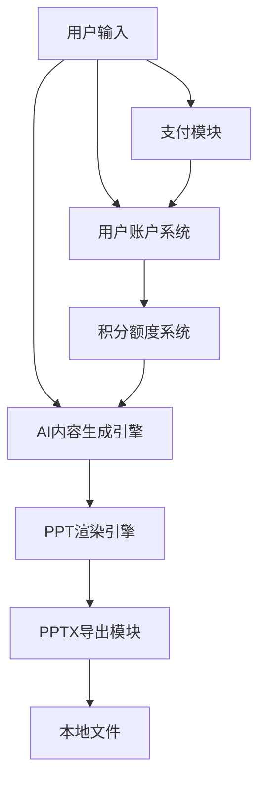

# 《产品需求文档 v2.0》

**文档状态**：草稿
**创建日期**：2026-05-05
**产品名称**：DemoPPT（AI PPT生成工具 v2.0）
**需求负责人**：DemoTech产品部
**版本历史**：
| 版本 | 日期 | 修改内容 |
|------|------|----------|
| 1.0 | 2026-05-04 | 初始版本 - 基础PPT生成功能 |
| 2.0 | 2026-05-05 | 针对竞品痛点的核心优化需求 |

---

## 一、背景与目标

### 1.1 背景
AI PPT生成工具市场在2025-2026年快速增长，Gamma、Beautiful.ai等国际工具占据先发优势，但在中国市场面临严重的水土不服问题：需要VPN访问、不支持中文界面、无法使用微信/支付宝支付、积分额度限制过快、导出PPT格式错乱等。

根据竞品用户反馈数据：
- Gamma在Trustpilot仅1.7/5分（94条评价）
- Gamma免费版400积分仅能生成约10个PPT
- Gamma导出PPT存在"架构性缺陷"，Web布局无法正确映射到Office格式
- 国际工具均不支持国内支付方式

### 1.2 问题陈述
国内用户需要一款**无需VPN、直接访问、中文友好、支持微信/支付宝支付、积分大方、导出格式完美的AI PPT工具**。

### 1.3 目标

**业务目标**：
- 成为国内用户首选的AI PPT工具
- 相比Gamma等竞品，在中文用户体验上形成压倒性优势
- 实现付费转化率提升

**用户目标**：
- 5分钟内生成专业PPT，无需设计基础
- 导出文件可在Microsoft PowerPoint/WPS中完美打开
- 使用微信/支付宝便捷支付

**成功指标**：
- 用户完成首个PPT的平均时间 < 5分钟
- PPT导出后在PowerPoint中格式正确率 > 95%
- 国内支付方式使用率 > 80%

---

## 二、用户与场景

### 2.1 目标用户

| 用户角色 | 描述 | 占比估算 |
|----------|------|----------|
| 职场白领 | 月度/季度汇报PPT制作需求 | 45% |
| 销售人员 | 客户提案、产品演示PPT | 25% |
| 教师/培训师 | 课件、培训材料PPT | 15% |
| 学生 | 论文答辩、课题汇报PPT | 10% |
| 其他 | 政府公务、党政汇报等 | 5% |

### 2.2 使用场景

**场景1：职场汇报**
- **用户**：职场白领
- **触发条件**：每月末需要制作月度汇报PPT
- **主流程**：输入主题 → AI生成大纲 → 确认 → 生成PPT → 下载PPTX
- **期望结果**：专业美观、可直接用于汇报

**场景2：客户提案**
- **用户**：销售/BD人员
- **触发条件**：客户会议前需要快速制作专业提案PPT
- **主流程**：上传客户背景资料 → 输入提案主题 → AI生成 → 微调 → 导出
- **期望结果**：格式完美、在客户现场可正常演示

**场景3：课件制作**
- **用户**：教师/培训师
- **触发条件**：备课需要制作教学课件
- **主流程**：输入课程主题 → 选择课件模板 → AI生成 → 补充内容 → 导出
- **期望结果**：符合教学场景、图文并茂

---

## 三、功能需求

### 3.1 功能模块总览

### 3.2 功能详述

#### 3.2.1 无限免费额度系统

**功能描述**：提供比竞品更宽松的免费额度策略

**用户故事**：
> 作为一个新用户，我希望有足够的免费额度体验完整功能，以便决定是否付费。

**功能优先级**：P1
**预估工时**：3人/日

**业务规则**：
| 规则编号 | 规则描述 | 优先级 |
|----------|----------|--------|
| FR-001 | 新用户注册即送500积分（Gamma仅400） | 必须 |
| FR-002 | 每日签到奖励20积分 | 应有 |
| FR-003 | 分享PPT到社交媒体奖励50积分 | 应有 |
| FR-004 | 付费用户月费套餐内无限使用 | 必须 |

**定价策略**：
| 套餐 | 价格 | 权益 |
|------|------|------|
| 免费版 | ¥0 | 500积分/月，基础模板 |
| Pro版 | ¥29/月 或 ¥199/年 | 无限积分，高级模板，优先队列 |
| Team版 | ¥99/月（5人起） | 无限积分，品牌VI，团队管理 |

#### 3.2.2 真正PPTX导出模块

**功能描述**：基于python-pptx库直接构建PPTX文件，而非Gamma式的Web到PPTX转换

**用户故事**：
> 作为一个销售，我生成的PPT要拿给客户演示，必须能在PowerPoint中完美打开。

**功能优先级**：P1
**预估工时**：5人/日

**业务规则**：
| 规则编号 | 规则描述 | 优先级 |
|----------|----------|--------|
| EXP-001 | 使用python-pptx库直接生成.pptx文件 | 必须 |
| EXP-002 | 确保16:9标准比例 | 必须 |
| EXP-003 | 字体嵌入（微软雅黑、宋体等中文字体） | 必须 |
| EXP-004 | 图表和图片直接插入PPTX | 必须 |
| EXP-005 | 支持WPS和Microsoft Office双兼容 | 必须 |

**技术实现**：
- 不采用Gamma的Web渲染方案
- 直接使用python-pptx构建PPTX XML结构
- 中文字体使用shape工厂方法注入

#### 3.2.3 中文优先界面与内容优化

**功能描述**：专为中文用户设计的界面和内容生成

**用户故事**：
> 作为一名教师，我不擅长英文，界面和生成内容必须都是中文的。

**功能优先级**：P2
**预估工时**：4人/日

**业务规则**：
| 规则编号 | 规则描述 | 优先级 |
|----------|----------|--------|
| CN-001 | 全站中文界面，无英文残留 | 必须 |
| CN-002 | 中文内容生成使用中文LLM模型 | 必须 |
| CN-003 | 中文排版遵循中文阅读习惯（段前距、标点压缩） | 应有 |
| CN-004 | 提供中文模板100+套 | 应有 |
| CN-005 | 中文节日/节气主题模板 | 可选 |

#### 3.2.4 微信/支付宝支付系统

**功能描述**：集成国内主流支付方式

**用户故事**：
> 作为一个想付费的用户，我希望用微信或支付宝付款，不需要国际信用卡。

**功能优先级**：P0
**预估工时**：3人/日

**业务规则**：
| 规则编号 | 规则描述 | 优先级 |
|----------|----------|--------|
| PAY-001 | 微信支付集成 | 必须 |
| PAY-002 | 支付宝支付集成 | 必须 |
| PAY-003 | 支持公众号支付（微信内购） | 应有 |
| PAY-004 | 订单系统与用户账户绑定 | 必须 |
| PAY-005 | 支付成功即时到账，无延迟 | 必须 |

**接口需求**：
| 接口名称 | 类型 | 说明 |
|----------|------|------|
| /api/pay/wxpay | POST | 微信支付下单 |
| /api/pay/alipay | POST | 支付宝下单 |
| /api/pay/callback | POST | 支付回调通知 |
| /api/user/subscription | GET | 查询订阅状态 |

#### 3.2.5 稳定高质量内容生成

**功能描述**：提升AI生成内容的准确性和逻辑性

**用户故事**：
> 作为一个月度汇报的用户，AI生成的内容要准确可用，我不想花大量时间修改错误。

**功能优先级**：P1
**预估工时**：6人/日

**业务规则**：
| 规则编号 | 规则描述 | 优先级 |
|----------|----------|--------|
| QUAL-001 | 生成后自动检查事实性错误（基础核查） | 应有 |
| QUAL-002 | 提供「重新生成」和「精修」二次编辑 | 必须 |
| QUAL-003 | 大纲预览确认后再生成完整PPT | 必须 |
| QUAL-004 | 支持上传参考文档喂入内容 | 应有 |
| QUAL-005 | 生成内容保留版权声明 | 应有 |

**提示词工程**：
- 针对PPT场景优化的prompt模板
- 中文长文本处理优化
- 逻辑连贯性检查

#### 3.2.6 国内可直接访问（无需VPN）

**功能描述**：国内服务器部署，直接域名访问

**用户故事**：
> 作为一个用户，我打开浏览器就能用，不需要任何特殊工具。

**功能优先级**：P0
**预估工时**：2人/日（DevOps）

**业务规则**：
| 规则编号 | 规则描述 | 优先级 |
|----------|----------|--------|
| NET-001 | 服务器部署于国内（阿里云/腾讯云） | 必须 |
| NET-002 | ICP备案完成 | 必须 |
| NET-003 | 域名直连访问，无任何限制 | 必须 |
| NET-004 | CDN加速覆盖全国 | 应有 |
| NET-005 | HTTPS全站加密 | 必须 |

---

## 四、非功能需求

### 4.1 性能要求
- 页面首屏加载时间 ≤ 2s（国内网络）
- AI生成PPT平均时间 ≤ 30s
- 接口响应时间 ≤ 500ms
- 支持并发用户数 ≥ 1000

### 4.2 兼容性要求
- 浏览器：Chrome/Edge/Firefox/Safari 最新版
- 操作系统：Windows/macOS/iOS/Android
- 导出格式兼容：Microsoft Office 2016+/WPS

### 4.3 安全要求
- 用户数据加密存储
- 支付信息不走我方服务器（使用官方SDK）
- 实名认证（根据法规要求）
- 内容安全审核

### 4.4 监控与日志
- 支付链路全日志
- AI生成质量监控
- 错误率实时告警

---

## 五、验收标准

### 5.1 功能验收

| 功能点 | 验收条件 | 测试方法 |
|--------|----------|----------|
| 注册送积分 | 新用户注册后账户显示500积分 | 注册流程测试 |
| PPT导出 | 用PowerPoint/WPS打开导出的.pptx文件，格式完整正确 | 手动打开测试10+文件 |
| 微信支付 | 完成支付后积分即时到账 | 实际支付测试 |
| 中文界面 | 全部界面无英文 | 人工审查 |
| 无VPN访问 | 国内网络直接打开 | 异地测试 |

### 5.2 验收流程
1. 开发自测通过
2. 产品经理功能验收
3. 内部用户测试（20人）
4. 灰度上线（100用户）
5. 全量上线

---

## 六、依赖与风险

### 6.1 依赖项
| 依赖方 | 依赖内容 | 预计完成时间 |
|--------|----------|--------------|
| 微信支付 | 商户号申请 | 1-2周 |
| 支付宝 | 商家服务开通 | 1-2周 |
| 国内服务器 | 云服务采购+ICP备案 | 2-3周 |
| LLM API | 内容生成模型 | 已集成 |

### 6.2 风险项
| 风险描述 | 影响 | 缓解措施 |
|----------|------|----------|
| 支付资质申请失败 | 无法实现付费 | 预备Stripe作为备选 |
| ICP备案时间过长 | 上线延迟 | 提前2个月启动备案 |
| LLM服务不稳定 | 生成失败 | 多模型备份 |

---

## 七、附录

### 7.1 参考资料
- [痛点报告链接](./reports/PERPETUAL_CYCLE_2026-05-05_000100.md)
- [KANO分析链接](./reports/KANO_PRIORITY_DemoPPT_20260505.md)
- [竞品分析报告](./competitor_analysis.md)

### 7.2 术语表
| 术语 | 定义 |
|------|------|
| PPTX | Microsoft PowerPoint Open XML格式的演示文稿文件 |
| python-pptx | Python库，用于生成和更新PowerPoint文件 |
| CDN | 内容分发网络，加速静态资源访问 |
| ICP备案 | 中国互联网信息服务备案 |
